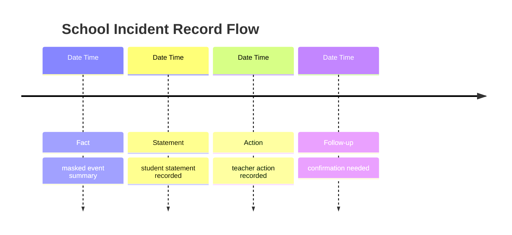

# Output Schemas

## fact-statement-action-table.md

```md
# Fact Statement Action Table

| Date | Time | Student | Category | Content | Source | Manual Basis | Verification | Follow-up |
|---|---|---|---|---|---|---|---|---|
```

## incident-timeline.md

```md
# Incident Timeline

| Date | Time | Type | Content | Source | Verification |
|---|---|---|---|---|---|
```

## incident-timeline-visual.md

Use Mermaid when possible:



## admin-report-draft.md

```md
# Admin Report Draft

## Confirmed Records

- Source-based, masked, neutral statements only.

## Needs Confirmation

- Missing date/time/source/manual basis/procedure items.

## Manual Basis

- List checked reference files and unresolved reference gaps.

## Caution

- This draft does not determine school violence, education activity infringement, offender-victim status, sanctions, or final procedure.
```

## teacher-review-checklist.md

```md
# Teacher Review Checklist

- [ ] Shared outputs contain no real names or direct identifiers.
- [ ] Facts and statements are separated.
- [ ] Each item has a source or `확인 필요`.
- [ ] No school violence or education activity infringement determination is made.
- [ ] No sanctions or official actions are stated as completed.
- [ ] NEIS drafts are reviewed by the teacher before manual entry.
```
